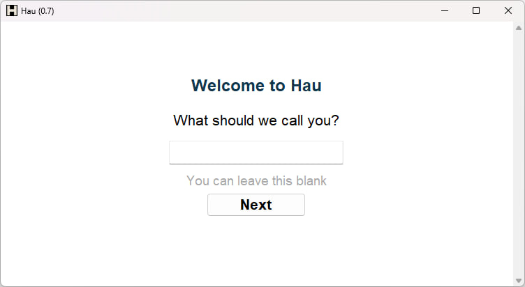
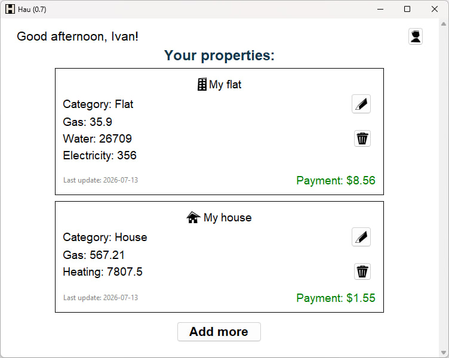
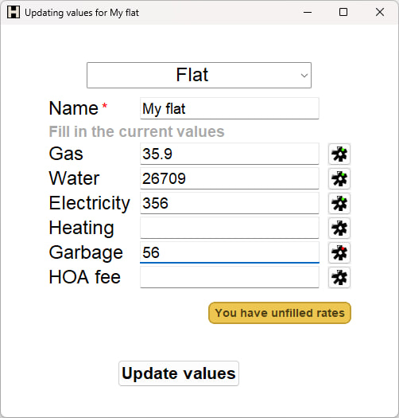
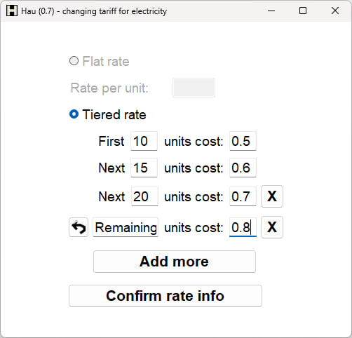

# Hau


**Hau** is a desktop app for tracking utility meter values, configuring tariffs, and calculating utility payments.

## Features
- Add and edit properties
- Store utility meter values
- Configure flat and tiered tariffs
- Use remaining-units logic for tiered tariffs
- Calculate utility payments automatically
- Choose interface language on first launch
- Configure preferred currency
- Edit user settings later
- Store data locally in SQLite

## Screenshots
### First launch


### Main screen


### Value editor


### Tariff editor


## Tech Stack
- Python
- Tkinter
- CustomTkinter
- SQLite
- Pillow
- JSON localization
- locale formatting

## Installation
```bash
git clone https://github.com/ivanKislyak/hau.git
cd hau
pip install -r requirements.txt
python main.py